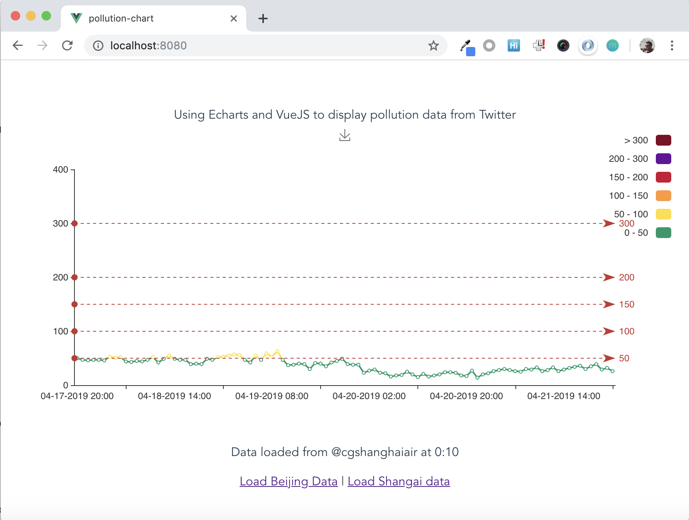

# 🏭 Pollution? Here's a chart.

Using Echarts and VueJS to display pollution data from Twitter.

#### [See Demo](https://miguelrincon.github.io/pages/pollution-chart/index.html)

## A screenshot for busy folks

*Took this one on a good day!*

## Project setup
```sh
npm install # Setup
npm run serve # Develop
npm run build # Publish
```

## Thanks to:
- [ECharts](https://ecomfe.github.io/echarts-doc/public/en/index.html): Chart library
- [Beijing  AQI](https://twitter.com/beijingair): Beijing AQI published hourly AQI updates.
- [CORS Anywhere](https://cors-anywhere.herokuapp.com/): Skip some Same-domain restrictions placed by Twitter API.
- [VueJS](https://vuejs.org/): The Progressive
JavaScript Framework
